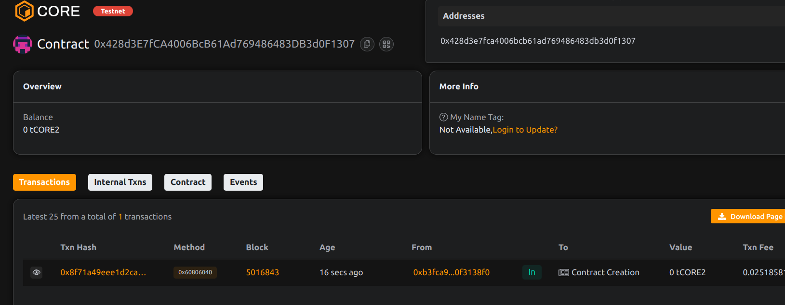

# Project Title: FlashX: Autonomous Arbitrage Bot with Flash Loans

## Project Done By: Avni Pal

## Project Description

FlashX is an autonomous arbitrage engine that leverages flash loans to execute profitable token swaps across multiple decentralized exchanges (DEXs). It identifies price discrepancies between trading pairs and captures risk-free profits, all within a single transaction.

## Project Vision

To create a permissionless, composable bot that anyone can deploy or integrate  into their DeFi strategies, enabling advanced financial automation using flash loans.

## Key Features

- Supports arbitrage across any two DEXs with compatible interfaces
- Uses flash loans for capital efficiency and atomic trade execution
- Profit enforcement logic to avoid unprofitable trades
- Withdrawable profit for bot owner

## Future Scope

- Integrate with on-chain arbitrage opportunity detectors
- Gas fee optimization and bundling
- DAO-controlled vault for pooled arbitrage profit
- Real-time dashboard for trade tracking and statistics

## Contract Details
0x428d3E7fCA4006BcB61Ad769486483DB3d0F1307

